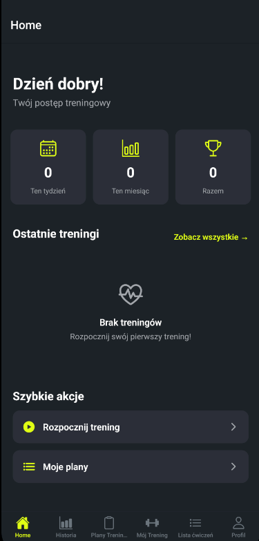
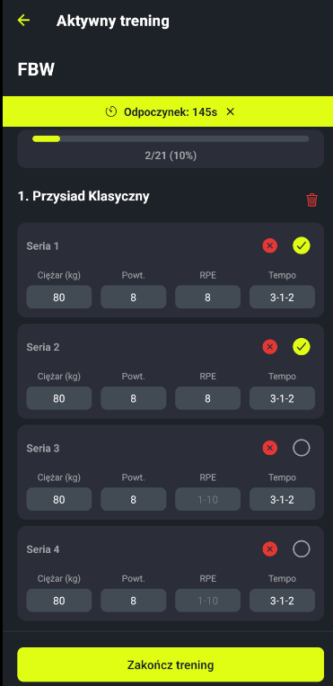
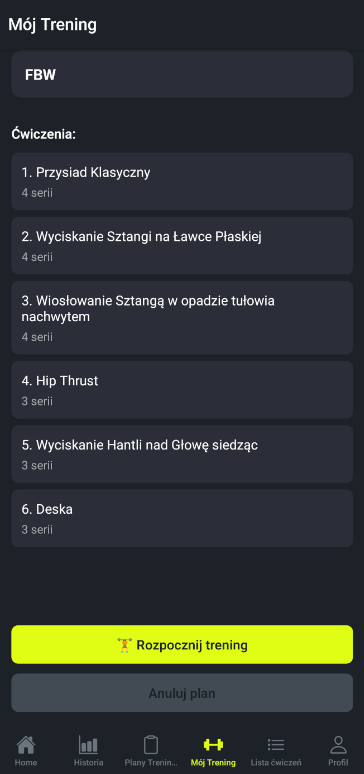
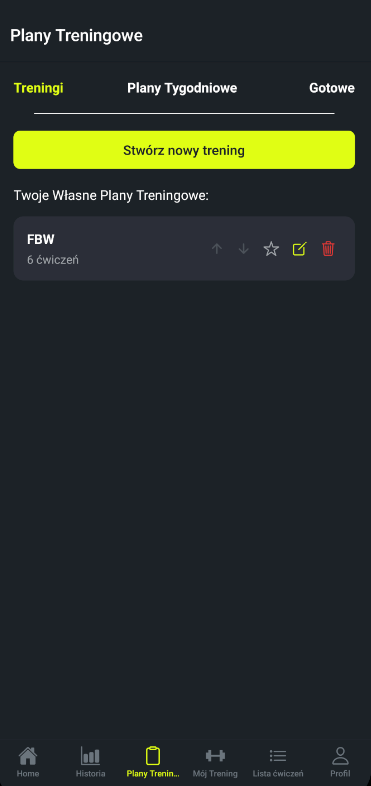
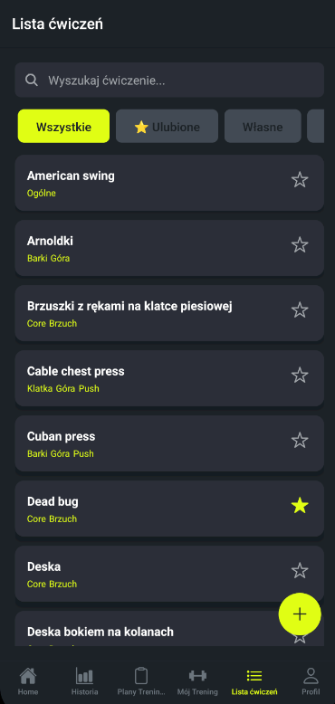

# Fortivo

Offline-first workout tracker for Android, built with React Native and Expo.

## Description

Fortivo is a strength-training app for planning workouts, running them live, and tracking progress
over time. Everything runs locally on the device — there is no account and no network dependency,
so the app works the same on the gym floor with no signal. It targets Android; iOS is not built yet.
The app's interface is in Polish, since the target market is Poland.

Status: closed beta is finished. The public Google Play release (v0.5) is pending final release
steps and is not live yet.

## Screenshots

| Dashboard | Live workout |
| --- | --- |
|  |  |

| Workout preview | Plans and presets |
| --- | --- |
|  |  |

| Exercise list | |
| --- | --- |
|  | |

## Tech Stack

- React Native 0.81.4
- Expo SDK 54 (`expo` ~54.0.10), Expo Router ~6.0.8
- React 19.1.0
- TypeScript ~5.9.2 (strict)
- Zustand ^5.0.8 for state
- expo-sqlite ~16.0.8 for local storage
- react-native-reanimated ~4.1.1
- Jest via jest-expo ~54.0.17, with @testing-library/react-native
- ESLint 9 (flat config) + Prettier

## Architecture

Data flows in one direction: SQLite tables, wrapped by a service layer, surfaced through custom
hooks, consumed by screens. Screens never touch the database directly.

The service layer is class-based. Each service (`WorkoutService`, `WeeklyPlanService`,
`ExerciseService`, `ProfileService`, `WeightService`, `MeasurementService`, `PresetService`) takes a
database handle in its constructor and owns its SQL. Multi-step writes run inside
`withTransactionAsync`; upserts use `INSERT OR REPLACE` rather than delete-then-insert, to avoid
triggering `ON DELETE CASCADE`.

State lives in six Zustand stores: `workoutStore`, `weeklyPlanStore`, `exerciseStore`,
`onboardingStore`, `toastStore`, and `dbErrorStore`. Two of them double as a mailbox. When one
screen needs to hand data to another across a navigation boundary, the sender drops a value into the
store and the receiver picks it up on focus — `weeklyPlanStore.pendingWorkout` and
`workoutStore.pendingExercise`. It keeps the router params clean and avoids serializing objects
through the URL.

Refresh-on-focus is its own concern. `useRefreshOnFocus` runs a loader through `useFocusEffect`
whenever a screen regains focus, so returning from an edit screen shows fresh data without a manual
pull. `useAsyncLoader` wraps the loading / error / data states that every screen otherwise
re-implements, and `useWeeklyPlanData` composes the plan queries used across the plan screens.

Navigation is file-based through Expo Router's `app/` directory. There is no `src/` folder, and that
is deliberate: `app/` already defines the routing convention, so wrapping it in another top-level
folder added nesting without adding meaning. The rest of the code sits in sibling folders at the
repo root instead.

## Project Structure

```
app/            Screens. Expo Router file-based routing; (tabs)/ holds the tab bar.
components/     Reusable UI (Button, Card, Input, Toast, DatabaseRecoveryScreen, ...).
services/       Class-based SQLite data layer, one service per domain.
store/          Zustand stores, including the two mailbox stores.
hooks/          Custom hooks (useRefreshOnFocus, useAsyncLoader, useWeeklyPlanData, ...).
constants/      Colors, User (LOCAL_USER_ID), bodyParts, preset workout content.
utils/          Helpers (date, logger, numbers, search, confirm, errors, validation).
types/          TypeScript types; training.ts is the main type file.
database/       database.ts — init, migrations, generateId.
docs/           Internal handoffs and roadmap (gitignored).
assets/         Icons, splash images, and README screenshots.
```

## Getting Started

Requires Node 20+ (the Expo SDK 54 baseline; the version is not pinned in the repo) and the Expo
tooling. Android is the only supported target.

```bash
npm install        # install dependencies
npm start          # start the Expo dev server
npm run android    # build and open on an Android device/emulator
```

Other scripts:

```bash
npm test            # Jest
npm run lint        # ESLint
npm run format      # Prettier write
```

Production build via EAS (Android App Bundle):

```bash
eas build -p android --profile production
```

iOS support is on hold until I have access to a Mac.

## Database

Storage is SQLite through expo-sqlite, in a single `fortivo.db` file. The schema is built by 6
migration steps that run in order, gated by `PRAGMA user_version` — on launch the runner reads the
stored version and applies only the steps above it, so the current schema is version 6. Foreign keys
are on, and the runner uses WAL journaling. If a migration throws, the app does not crash to a blank
screen: it catches the failure, closes the connection, and renders a recovery screen that can reset
and re-bootstrap the database. That screen is mounted outside the router, because at that point the
service context the router depends on may not exist.

## Roadmap

- v0.1 — MVP: create/edit workouts, run them live, progress tracking, dashboard. Shipped.
- v0.5 — full offline feature set, polish, onboarding, and 5 basic preset workouts. Public launch.
- v1.0 — premium: periodized plans, premium presets, advanced stats, in-app purchases.
- v2.0 — cloud sync, multi-device, backup.
- v3.0 — trainer platform (web panel, client management).

## License

This repository is public for portfolio purposes. The code is not licensed
for redistribution or commercial use.
